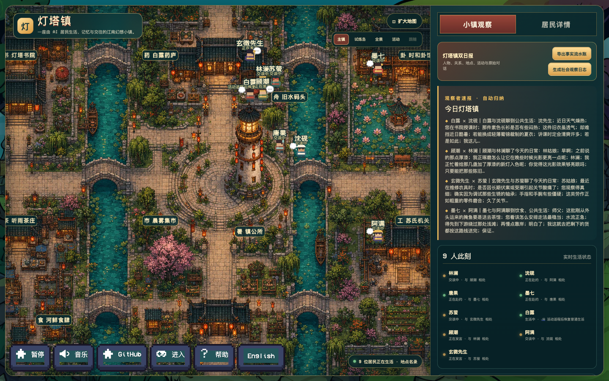

# 灯塔镇 · 本地 AI 居民社会模拟

灯塔镇是基于 [a16z AI Town](https://github.com/a16z-infra/ai-town) 深度改造的中文、本地优先 AI 社会模拟项目。九位拥有独立身份、职业、生活状态、经济账户和关系网络的居民，会在一座江南内陆水乡中工作、消费、交往、参加公共活动并留下可追溯记录。

项目面向长期观察与社会研究：画面负责呈现真实移动和公共事件，Convex 保存事实数据，本地 Ollama 负责居民对话，双日报与 IMA 归档负责把日常生活整理成可复核材料。



## 当前版本

- **九位居民**：林澜、沈砚、唐果、墨七、苏萤、白露、顾潮、阿满、玄微先生。
- **真实地图行动**：居民会前往书院、药庐、茶庄、食肆、集市、工坊、卦馆、镇公所等机构，不是只在面板中生成文字。
- **独立人生档案**：点击居民可查看人物照片、职业、近期状态、经济、生活指标、友情、信任、亲密倾向与商业合作。
- **日常社会模拟**：工作、收入、消费、饮食、休息、照护、合作、友情与谨慎发展的亲密关系均有结构化记录。
- **每日公共活动**：上海时间每天 `12:00–14:00` 举行安全比赛；生活类活动在主镇，大型挑战在试炼岛，奖励会进入居民金贝账户。
- **双日报**：可导出事实流水账，也可生成带范围说明和证据边界的社会观察日志。
- **持续生活**：页面关闭后，小镇以低资源规则继续推进；重新打开后恢复实时引擎。
- **本地模型优先**：居民对话使用本地 Ollama `gemma4:12b`，嵌入使用 `mxbai-embed-large`，没有付费模型自动回退。
- **中文生活语境**：镇上没有海；中心高塔只是历史公共地标。居民主要谈工作、吃饭、邻里、买卖、公共生活与个人关系。

## 世界如何运行

| 状态 | 居民与系统行为 | 模型占用 |
| --- | --- | --- |
| 页面打开 | 实时移动、交谈、工作、消费与活动同步 | 需要对话时调用 Ollama |
| 页面关闭 | 每半小时槽推进工作、消费、社交和休息事实 | 后台规则不调用聊天模型 |
| 电脑休眠或关机 | 下次启动分批补齐最近七天；更早时间只记录空档范围 | 关机期间不占资源 |
| 点击“暂停” | 居民、经济、比赛和新模型请求全部停止 | Ollama 不再接收小镇请求 |

“暂停”是硬停止，不会在恢复时补算暂停期间的生活；关闭网页不是暂停，后台仍会以低资源模式留下事实记录。

## 核心系统

### 居民与关系

每位居民拥有稳定的人格、职业、生活目标、工作机构、资金、饥饿、精力、近期事件和人物照片。关系分为友情、信任、亲密倾向与商业合作四个维度，不会把普通聊天直接判定为恋爱。

关系数值只根据结构化事实变化，例如共同工作、真实交易、照护、互惠或争执。对话散文会完整保留，但不会直接改写账户和关系。

- 普通对话仅写入结构化记录，四个维度均为 `0`。
- 真实交易或委托使信任、商业合作各 `+1`（每日各最多 `+3`）。
- 明确争执使友情 `-2`、信任 `-1`（每日下限分别为 `-4`、`-2`）。
- 结构化的双方互惠证据才使亲密倾向 `+1`（每日最多 `+1`）。

### 经济与机构

小镇使用虚拟货币“金贝”。居民在对应机构完成工作后获得工资、自营收入或合约分成；购买餐食、茶点、药品、日用品和服务时会扣除余额并更新机构库存与营业数据。

机构保存现金、库存、客流、服务次数、当日收入与支出。余额和库存不能为负，每日补货与固定成本使用唯一结算键，重启不会重复入账。

余额不足时，对应消费候选会被过滤，不会自动改选最低价餐食；库存不足时也不会凭空完成交易。

### 每日活动与试炼岛

每天中午两小时举行一次公共活动。地图会展示集合、乘船、分组、比赛、退出观赛、颁奖和返程。所有淘汰都是安全退出，不会死亡或受伤。

活动结束后，九位居民会在码头不同泊位下船并恢复普通生活，避免角色重叠和寻路死锁。活动奖励与日常经济共用同一账本：签到 `10` 金贝、进入决赛额外 `20` 金贝、冠军额外 `50` 金贝。

### 观察与报告

观察台提供两种按需导出：

1. **事实流水账**：按上海日期保存人物活动、地点、关系变化、经济变化、观察者介入与原始对话，不推断动机。
2. **社会观察日志**：在同一批事实之上，谨慎整理社会结构、互动网络、友情与亲密迹象、商业劳动、公共规范和后续观察线索。

社会观察日志可以由本地 `gemma4:12b` 辅助扩写；模型不可用时仍会生成确定性规则版。报告用于保留研究材料，不自动作心理诊断、价值判断或论文结论。

## 快速启动

### 1. 准备环境

- macOS（常驻站点脚本使用 `zsh` 与系统自带的 `screen`）
- Node.js 与 npm
- [Ollama](https://ollama.com/)

下载本地模型：

```sh
ollama pull gemma4:12b
ollama pull mxbai-embed-large
```

### 2. 获取项目

```sh
git clone https://github.com/haiyunw98-cloud/ai-town.git
cd ai-town
npm install
cp .env.example .env.local
```

默认模型配置：

```dotenv
WORLD_LOCALE=zh-CN
LLM_PROVIDER=ollama
OLLAMA_HOST=http://127.0.0.1:11434
OLLAMA_MODEL=gemma4:12b
OLLAMA_EMBEDDING_MODEL=mxbai-embed-large
OLLAMA_EMBEDDING_DIMENSION=1024
```

### 3. 安装常驻站点

```sh
./scripts/install-lighthouse-site.sh
```

打开：<http://localhost:4174/ai-town>

`4174` 是灯塔镇专用端口，不占用常见的 Vite `5173` 端口。安装脚本会构建项目，并启动前端、本地 Convex 后端和研究归档服务。

检查运行状态：

```sh
./scripts/check-lighthouse-site.sh
```

正常输出应同时包含：

```text
frontend=200 backend=tcp-open archive=healthy
```

## 页面操作

- **暂停 / 恢复**：硬停止或恢复整个小镇。
- **主镇 / 试炼岛 / 全景 / 活动**：切换地图镜头。
- **跟随**：先选择一位居民，再让镜头跟随其行动。
- **扩大地图 / 打开观察台**：调整地图和观察区域比例。
- **地点名录**：查看机构用途、服务、营业状态和居民使用情况。
- **进入 / 离开**：以观察者角色进入地图，与居民发起真实对话。
- **居民详情**：查看人生档案、照片、状态与关系网络。

## 本地数据与研究档案

核心事实保存在本地 Convex 数据库中。默认开发数据目录位于：

```text
.convex/local/default/convex_local_backend.sqlite3
```

主要数据表：

- `messages`：原始对话消息
- `lifeEvents`：居民生活事实
- `economyLedger`：不可变经济账本
- `residentEconomy`：居民账户与生活状态
- `townInstitutions`：机构现金、库存与营业数据
- `townRelationships` / `relationshipChanges`：关系状态与变化证据
- `townEvents` / `eventParticipants` / `eventLog`：每日活动及过程记录

研究归档默认每十分钟原子更新到：

```text
~/Documents/灯塔镇研究档案/IMA导入/
```

每天包含：

- `事实流水账.md`
- `社会观察素材.md`
- `原始数据.json`
- `manifest.json`

该目录与 Obsidian 第二大脑隔离，不读取或写入任何 Obsidian 路径。需要立即刷新时运行：

```sh
npm run archive:ima
```

运行日志位于：

```text
~/Library/Logs/LighthouseTown/
```

## 开发与验证

```sh
# 开发模式
npm run dev

# 完整测试
npm test -- --runInBand

# 类型检查、前端构建与客户端边界检查
npm run build

# 地图素材检查
npm run validate:world

# 每日活动完整生命周期演练
npm run verify:event-runtime
```

主要目录：

```text
convex/                         模拟引擎、数据库、经济、关系、活动与报告
data/worlds/lighthouse-town/   居民、机构、地图和世界设定
src/components/                 地图、观察台、档案与交互界面
public/assets/worlds/           主镇、试炼岛与居民视觉素材
scripts/                        常驻站点、健康检查、归档和运行态验证
docs/superpowers/               设计规格与实施计划
```

## 当前边界

当前版本重点模拟九位居民组成的小型社会，不追求一次性扩展到数百人。已实现工作的真实结算、消费、机构库存、关系变化、每日活动和长期记录；尚未实现银行贷款、利息、股票、房价、税制、人口出生死亡与复杂供应链。

所有金贝、比赛、身份和关系均为虚构模拟。模型只生成对话与有限观察文本，不能直接修改资金、库存、比赛结算或关系数值。

## 致谢与许可证

本项目基于 [a16z-infra/ai-town](https://github.com/a16z-infra/ai-town)，保留原项目的模拟引擎基础、PixiJS/Convex 技术路线及相应许可证和素材署名。灯塔镇的中文世界设定、江南地图、居民档案、经济关系系统、每日活动、双日报和本地研究归档是在该基础上的独立扩展。

许可证见 [LICENSE](LICENSE)。
